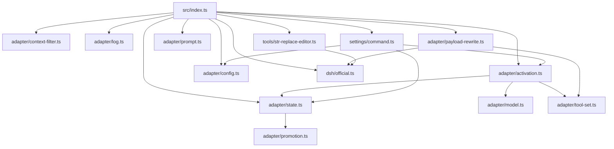

# Repository Guidelines

## Project Overview

`omp-dsh-minimal` is a source-only TypeScript plugin (extension) for the Oh My Pi (`omp`) coding-agent harness. It adapts sessions for DeepSeek Harness's "minimal" preset: on a matching model, the bootstrap request (request #1) exposes only the official two-tool catalog (`bash`, `str_replace_editor`) plus the one-line persona `You are a helpful software engineer assistant.`; after the first assistant reply or tool call, the adapter "promotes" the session back to Pi's full tool set and re-anchors the prompt.

- Installed via `omp plugin install git:https://github.com/kanren3/omp-dsh-minimal.git` (host CLI, not an npm script).
- Declared to the host via `package.json` → `omp.extensions: ["./src/index.ts"]`.
- Config file: `~/.omp/agent/omp-dsh-minimal.json` (`enabled`, `dumpRequests`, `modelPatterns`; defaults enabled with patterns `deepseek-v4-pro`, `deepseek-v4-flash`).

## Architecture & Data Flow

Import graph (no cycles; nothing imports `src/index.ts`):

Runtime flow (all wired in `src/index.ts`):

1. Seven host event hooks (`session_start`, `session_switch`, `session_compact`, `message_end`, `tool_call`, `context`, `before_provider_request`) call `refresh()` = `resyncSessionState` (from persisted `SessionEntry`s) → `isAdapterActive` → `syncSurface`.
2. `syncSurface` mutates the active tool set additively/removably and persists the cross-restart anchor marker (`ANCHORED_ENTRY_TYPE = "dsh-anchored"`) via `pi.appendEntry`.
3. `before_provider_request`: skip when inactive or when the payload is a summarization/compaction request (`isNonAgentProviderPayload`); otherwise build the persona (`MINIMAL_PROMPT` in bootstrap, `reanchorPersona` when promoted) and call `rewriteProviderRequest(event.payload, …)`, which **mutates the payload in place** (some hosts ignore the hook return value).
4. Promotion is set by `message_end` (assistant role / toolCall part) and `tool_call`, and restored after compaction/reset boundaries by `scanSessionPhase`.

## Key Directories

- `src/` — plugin source.
  - `src/index.ts` — entry point; default export `dshMinimal(pi)`; creates the singleton closure `AdapterState`, registers tool + command, wires the 7 hooks.
  - `src/adapter/` — adapter core: `activation.ts` (tool-surface state machine), `config.ts` (JSON config I/O), `state.ts` (runtime state + resync), `promotion.ts` (promotion detection), `model.ts` (model matching), `payload-rewrite.ts` (wire-payload rewriting; largest module), `context-filter.ts`, `prompt.ts`, `log.ts` (optional request dump), `tool-set.ts` (tool-name constants).
  - `src/dsh/official.ts` — **verbatim** upstream DeepSeek Harness minimal-preset strings/schemas (`MINIMAL_PROMPT`, `DSH_MINIMAL_TOOLS`, …). Treat as fixed; do not reword.
  - `src/settings/command.ts` — `/dsh` slash command (`status`, `on`, `off`, `dump on|off`).
  - `src/tools/str-replace-editor.ts` — adapter-owned tool (`view`/`create`/`str_replace`/`insert`).
- `tests/` — flat `*.test.ts`, one file per src module, named after it (e.g. `config.test.ts` ↔ `src/adapter/config.ts`).

## Development Commands

| Command | Action |
| --- | --- |
| `npm test` | `bun test tests/` (requires Bun on PATH) |
| `npm run typecheck` | `tsc -p tsconfig.json` (strict, `noEmit`) |
| `npm run check` | typecheck + tests — the full gate |
| `npm install` / `npm ci` | install deps (npm lockfile, `lockfileVersion: 3`) |

No `build`/`start`/`lint` scripts. No build output (`noEmit: true`); the host runs the TypeScript entry directly.

## Code Conventions & Common Patterns

- **TypeScript, strict** (`strict: true`), ES2022/`ESNext`, `moduleResolution: Node`, tabs for indentation, `"type": "module"`. All relative imports carry an explicit `.ts` extension (`allowImportingTsExtensions`): `from "../src/adapter/config.ts"`.
- **Pure functions + explicit `unknown` validation.** Narrow external input with an `isObject` guard (`src/adapter/payload-rewrite.ts:1-3`); no `any` casts on untrusted input.
- **Error handling:** throw `new Error(...)` for invalid tool params; caught I/O errors degrade to `console.warn` + defaults or `{ok: false, error}` results (`src/adapter/config.ts:57-63`, `src/adapter/log.ts:56-58`). Extract messages as `error instanceof Error ? error.message : String(error)`.
- **Async:** event handlers and tool executes are `async` (use `node:fs/promises`); config/log use sync `node:fs`. Config writes are atomic (temp file + `renameSync`).
- **No DI framework.** State is an explicit `AdapterState` object captured in the entry-point closure and passed down (e.g. `registerDshCommand(pi, state)`); `pi: ExtensionAPI` is the host interface.
- **In-place payload mutation is deliberate** (`payload-rewrite.ts`): mutate `event.payload` and mutate message arrays in place to preserve identity — never build replacement objects.
- **Additive tool management:** never call `setActiveTools` with a full replacement list; only add missing `BOOTSTRAP_TOOL_NAMES` or strip `ADAPTER_OWNED_TOOL_NAMES` (see comment in `src/adapter/activation.ts:37-41`).
- **No lint/format tooling** (no ESLint/Prettier/Biome); match the surrounding style.

### Invariants (read before editing)

- `AdapterState` is a singleton per plugin install, reset verbatim on **both** `session_start` and `session_switch` (`src/index.ts`) — new fields must be reset in both paths.
- Promotion flags must be cleared when `latestBoundaryIndex` advances (compaction/`reset_boundary`), or a stale epoch will promote the next request (`src/adapter/state.ts`).
- Never rewrite summarization/compaction provider payloads.
- `src/dsh/official.ts` strings/schemas must stay verbatim upstream DSH.

## Important Files

- `src/index.ts` — extension entry; hook wiring and `refresh()`.
- `package.json` — scripts, `omp.extensions` entry, devDependencies only.
- `tsconfig.json` — strict TS config; includes `src/**/*.ts` and `tests/**/*.ts`; no path aliases.
- `src/dsh/official.ts` — fixed upstream preset constants.
- `src/adapter/payload-rewrite.ts` — wire-payload rewriting; handles 3 tool-schema dialects (ChatCompletions / Anthropic / named-parameter).
- `src/settings/command.ts` — `/dsh` command and `formatDshStatus`.
- `README.md` — user-facing docs (note: README omits `/dsh dump on|off`, the `dumpRequests` config key, and the ` · request dump on` status suffix that the code implements).

## Runtime/Tooling Preferences

- **Tests require Bun** (`bun test`); Bun is system-provided, not in devDependencies. Host packages require `bun >= 1.3.14`.
- **Package manager is npm** (`package-lock.json`, `lockfileVersion: 3`). Install with `npm install`; run tests with `bun`.
- Source uses only `node:*` APIs (`node:fs`, `node:path`, `node:fs/promises`); no `Bun.*` usage.
- **No runtime `dependencies`/`peerDependencies`:** `@oh-my-pi/*` packages are devDependencies for typechecking/tests and are remapped by the omp host at runtime. Never add a runtime dependency on them.
- `tsx` is in devDependencies but referenced by no script — prefer `bun`/`tsc`.
- No CI, no git hooks, no `.nvmrc`/`.npmrc`.

## Testing & QA

- Framework: **node:test** + **node:assert/strict**, executed by **Bun's** test runner. No vitest/jest, no coverage tooling or expectations.
- Structure: flat `tests/*.test.ts`, top-level `test("…", fn)` only (no `describe`/`it`); sentence-case behavior titles.
- Imports: relative into src with `.ts` extensions; `import type` from `@oh-my-pi/*` for host types only.
- Mocks are hand-rolled object literals cast to host types (`{…} as unknown as ExtensionAPI`); recorder stubs capture calls (`setToolsCalls: string[][]`). Per-file factory helpers (`makeState`, `makePi`, `makeCtx`); no fixture files, no mock libraries.
- Filesystem tests use unique `mkdtempSync(join(tmpdir(), "omp-dsh-minimal-<scope>-"))` dirs; keep tests deterministic (fixed timestamps, no wall-clock).
- Assertions prefer exact equality (`assert.equal`/`assert.deepEqual`) and recorded-call tuples over loose `includes`; use `assert.rejects(fn, /regex/)` for errors.
- Gate before handing off: `npm run check`.
