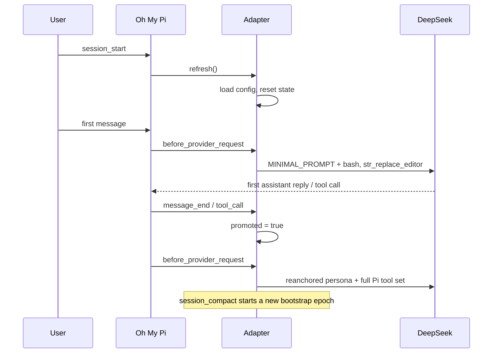

# omp-dsh-minimal

This is the Minimal **DeepSeek Harness** anchored-standard adapter for **Oh My Pi**. On a DeepSeek V4 session, Request #1 exposes only the official two-tool catalog (`bash` and `str_replace_editor`) along with the official one-line persona. The first subsequent assistant reply or tool call then restores the session to Pi's full tool set and re-anchors the prompt.

## Request lifecycle



| Phase | Tools exposed | System prompt |
| --- | --- | --- |
| Bootstrap (request #1) | bash, str_replace_editor | You are a helpful software engineer assistant. |
| Promoted (after first reply/tool call) | Pi's full active tool set | official one-liner + remaining Pi prompt |

## Install

```sh
omp plugin install git:https://github.com/kanren3/omp-dsh-minimal.git
```

## Usage

```text
/dsh status   show status
/dsh          same as status
/dsh on       enable the adapter
/dsh off      disable the adapter
```

Status reports the master switch, current-model activation, and promotion state:

```text
dsh: off
dsh: on · no current model
dsh: on · current model not matched
dsh: on · awaiting promotion · spec
dsh: on · promoted · spec
dsh: on · released (react)
dsh: on · released (weak)
```

On `/resume`, promotion state is rebuilt from the persisted session entries.

## Task classification

Before the first provider request, the adapter classifies the session's
first user message into one of the two stable behavior bands (keyword
counts, same classifier as dsh-router-standard):

- **spec** (fix / debug / refactor / review / …) — bootstrap engages:
  request #1 goes minimal, then promotes to the full Pi surface.
- **react** (build / create / develop / new project / …) or **weak**
  (ambiguous) — the session is **released**: no bootstrap, the native Pi
  prompt and full tool catalog pass through untouched from request #1.

The classification is locked at the first request (path commitment) and
survives compaction; `/clear` and `/compact` re-bootstrap a spec session
only.

## Configuration

`~/.omp/agent/omp-dsh-minimal.json` (override the base dir with `PI_CODING_AGENT_DIR`):

```json
{
  "enabled": true,
  "modelPatterns": ["deepseek-v4-pro", "deepseek-v4-flash"]
}
```

- `enabled` — master switch (default `true`).
- `modelPatterns` — substring match against `provider` / `id` / `name` after normalization (lowercased, separators collapsed). Only matching models run the adapter.

## References

- [pi-dsh-minimal](https://github.com/Averyyy/pi-dsh-minimal) — Pi adapter for official DeepSeek Harness minimal mode.